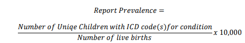
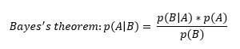

## Contents
* **Calculation of Report and Prevalence Estimates**\n
* **Report Prevalence**\n
* **Defect Prevalence**\n 
* **Interpreting Prevalence Estimates**\n

## Surveillance Notes
### Calculation of Report and Prevalence Estimates
Analyses are based on each occurrence of a unique combination of child and condition. An infant can have multiple defects and is counted as a separate case for each defect. For example an infant with Trisomy 21 and Cleft Lip would be counted as a unique case for Trisomy 21 and a unique case for Cleft Lip. Thus the number of different cases cannot be added together to reach the total number of infants
with a defect.

When an infant has two or more conditions within the same category in an analysis it is only counted once.

Ideally, for measure of disease occurrence, the incidence rate would be used. However, the population at risk (denominator) is difficult to quantify for birth defects research. Since the number of conceptions is unknown as are the number of cases lost through spontaneous or other abortion and some fetal deaths we cannot determine incidence. For this reason the prevalence at birth is used to represent the
disease occurrence.

Birth defects are rare events and Alaska’s population is small. To account for year-to-year variation all prevalence estimates are based on 5-year moving averages (Note: estimates contained in specific reports if available may display 3-year moving average trend lines). To be included, a reported individual
must link to an Alaskan birth certificate. Prevalence Estimates are always cited as per 10,000 live births.

### Report Prevalence
The report prevalence is the prevalence at birth of a specific defect based on the count of unique children identified through a reported ICD code representing a specified condition regardless of case confirmation status.

Note: both the numerator and denominator are restricted to the same time frame (3-year or 5-year window) and are based on birth year of the child.

### Defect Prevalence
The defect prevalence is the estimated prevalence at birth of a specific defect. This estimate uses a Bayesian approach to incorporate the historical sampled confirmation probability and the estimated missed cases probability by restricting the analysis to children diagnosed and seen by a medical provider before age 3 years.

We use the informative known prior obtained through sampled case confirmation of reported cases (Positive Predictive Value) and (1-Negative Predictive Value) to calculate the estimated probability of
defect. Thus:

The 𝑝(𝐷|𝑅̅) is generated by enumerating the “missed” case probability from reports of children ages 3-6
years of age among historical data. This estimate is calculated for each condition and considered a
constant over time, under the assumption that children reported for the first time for condition “x”
between the ages of 3 and 6 years will follow a constant distribution over time. These estimates will be
refined with additional sample draws, confirmations, and assessments.
Updated April 2019 Version 2 2

The Confidence interval for both the estimate based on reports without confirmation and defect
estimate are based on the Poisson distribution. The exact method for estimation:

Note: Confidence Intervals are calculated using an ‘exact’ method. This method is based on the exact
distribution opposed to an approximation. Exact methods are a conservative approach and useful with
small cell counts.
Interpreting Prevalence Estimates
The Registry’s focus is to:
 Improve the consistency of reporting among core agencies.
 Stabilize and improve the confidence in calculated prevalence estimates.
The Registry has attempted to produce prevalence estimates with improved accuracy by incorporating
informative prior information and by utilizing specific condition defect estimates (DE) from medical
record reviews.
Differences in defect and reported prevalence estimates over time or between regions may reflect
variance in reporting, leading to differential detection bias, true differences influenced by genetic,
environmental or other causes, or even chance differences.
These estimates are limited to live births occurring in Alaska, as such estimates for certain defects that
result in spontaneous abortion, high fetal mortality, or frequently delivered out-of-state are likely underrepresented.
Defect classification in the Alaska Birth Defect Registry is made by collecting and aggregating ICD codes
representing birth defects from multiple agencies across the state. As such, variation in clinical and
diagnosis practices, expertise, electronic health records, and miscoding by coders/providers all may
influence case detection and classification. ICD codes used in passive surveillance system can potentially
misrepresent the actual prevalence, and caution should be used when interpreting the reported
prevalence in the absence of estimated defect prevalence.
The estimates provided are believed to be the most accurate, but are subject to large variation resulting
from surveillance methodology.
Updated April 2019 Version 2 3

As additional samples are drawn and medical records abstraction and confirmation occurs, the defect
estimates will be updated and expanded.
Updated April 2019 Version 2 4 